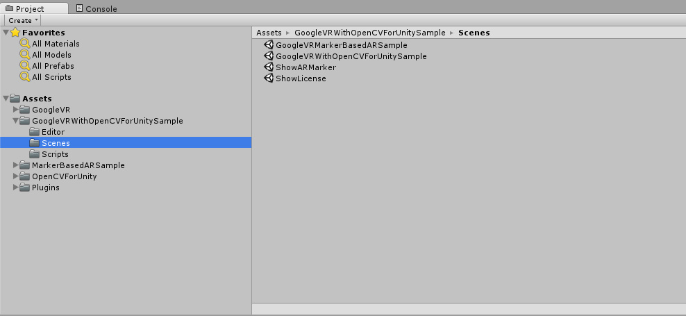

GoogleVR With OpenCVForUnity Sample
====================

Screen Shot
-----

Environment
-----
Windows 8.1  
Unity 5.3.0f4  
OpenCVForUnity2.0.9  
GVR Unity SDK v1.0.3

Setup
-----
* Create New Project. (GoogleVRMarkerBasedARSample)
* Import OpenCVForUnity2.0.9 from AssetStore  
* Import MarkerBased AR Sample1.1.9 from AssetStore  
* Import GoogleVRForUnity.unitypackage  
* Import GoogleVRWithOpenCVForUnitySample.unitypackage 
* Change Product Name. (GoogleVRMarkerBasedARSample)  
* Change PlayerSettings.bundleIdentifier. (xxx.xxxxxxx.googlevrmarkerbasedarsample)  
* Add the “Assets/GoogleVRWithOpenCVForUnitySample/Scenes/*.unity” files to “Scenes In Build” list in “Build Settings” window.
* Set In PlayerSettings, at the bottom under Settings for iOS, click Resolution and Presentation to expand that panel. Set the Default Orientation to Auto Rotation, and then uncheck all of the Allowed Orientations for Auto Rotation except for Landscape Left.

  
  
  
  
  
  

Android Build
-----
[GoogleVRWithOpenCVForUnitySample.apk](GoogleVRWithOpenCVForUnitySample.apk)

 

